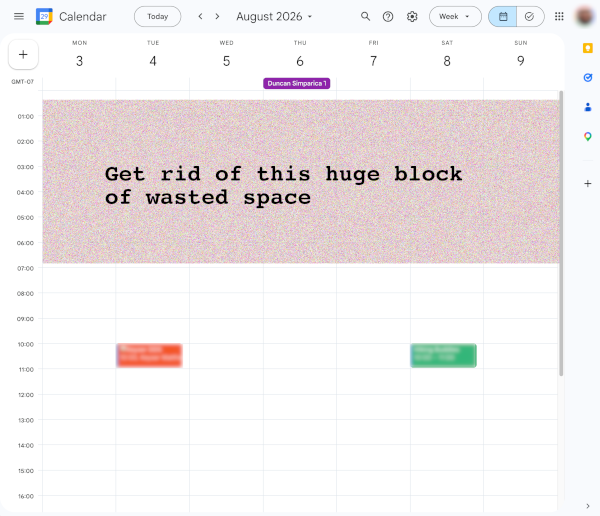

# Google Calendar View Optimizer

## Firefox Extension

To install use the public app store:

https://addons.mozilla.org/addon/google-calendar-view-optimizer/

## Demo

## Motivation

This used to be a built-in Lab in Chrome but was removed and now only exists in a commercial Chrome extension called [GCalPlus](https://chromewebstore.google.com/detail/gcalplus/mjelhipeelammmhpghkpigkdonihkakj?hl=en)

## Support

Please use GitHub issues link above for any problems or feature requests. Please include the version of Firefox you're using if possible.

## Contributing

Pull requests welcome!

## Developer Links

- [web-ext docs](https://developer.mozilla.org/en-US/docs/Mozilla/Add-ons/WebExtensions/Getting_started_with_web-ext)
- To run your changes locally, use `npm start`

## Changelog

- 2026.4.1 initial working release